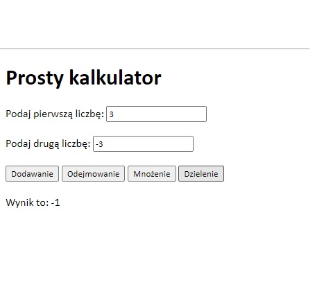

# simple-calculator

## Table of contents
* [General info](#general-info)
* [Link to GitHub Pages](#link-to-gitHub-pages)
* [Screenshots](#screenshots)
* [Technologies](#technologies)
* [Status](#status)

## General info
This simple calculator was created while improving my practical skills in front-end web development during the "Web Design" training in which I participated.

## Link to GitHub Pages
https://annlemottien.github.io/simple-calculator/

## Screenshots

## Technologies
Project is created with:
* JavaScript
* HTML
* CSS

## Status
Project is _in progress_
